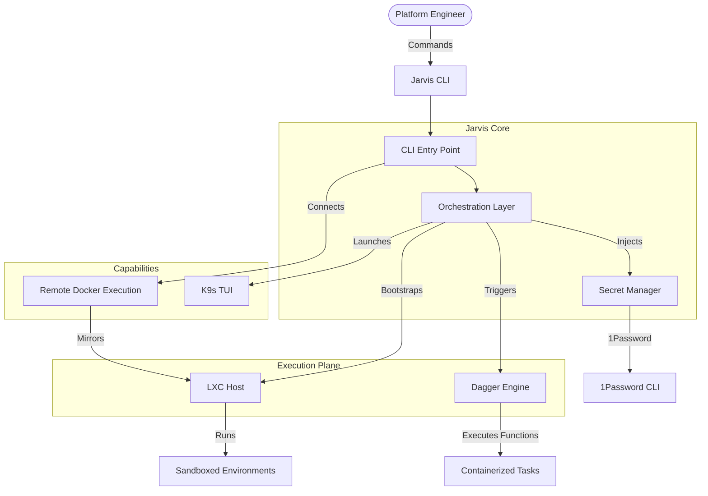

# Jarvis CLI System Architecture

## Description
- **Jarvis CLI**: The main entry point.
- **Dagger**: Used for pipeline execution and function orchestration.
- **LXC**: "The Real GOAT" runner for sandboxing and high performance.
- **1Password**: Integrated for secret injection (no secrets in disk).
- **K9s**: Embedded TUI for Kubernetes management.
