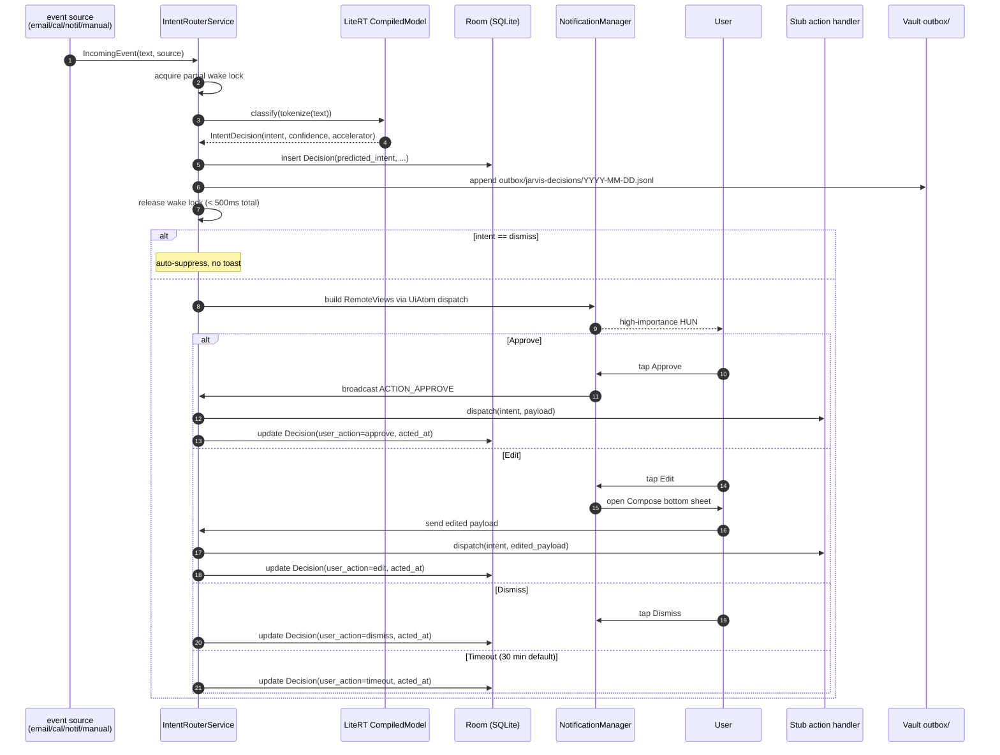

# Phase 1 — Architecture & Intent Schema

This document is the **integrity boundary** for the Phase 1 training pipeline. Every
synthetic training record must be labeled with one of the seven intents below and no
others. Any change to this schema is a model-rebuild: the tokenizer hash, training
data hash, and conversion pipeline must all be re-run. Bump `intent_schema_version`
in [training/jarvis_training/synth/](../training/jarvis_training/synth/) on every
non-trivial edit.

> **This file is the Step 1.1 gate.** Synthetic data generation (Step 1.2) is blocked
> until the user explicitly signs off on the schema below.

## Event → classify → toast → action

```
                 ┌─────────────────────────────────────────────────────┐
                 │                IntentRouterService                   │
                 │                (foreground, dataSync+specialUse)     │
 IncomingEvent ─►│   ┌──────────┐   ┌──────────┐   ┌────────────────┐  │
   • email       │   │ tokenize │──►│  LiteRT  │──►│  IntentDecision │  │── log to Room
   • calendar    │   │   .json  │   │ CompiledM│   │  + confidence   │  │── append outbox jsonl
   • manual_test │   └──────────┘   └──────────┘   └────────────────┘  │
   • notif_listen│                                          │           │
                 │                                          ▼           │
                 │                              ┌─────────────────────┐ │
                 │  intent==dismiss?  yes ────► │ suppress (no toast) │ │
                 │  no                          └─────────────────────┘ │
                 │   │                                                  │
                 │   ▼                                                  │
                 │  build toast payload by intent  ──► NotificationManager
                 │                                          │           │
                 └──────────────────────────────────────────┼───────────┘
                                                            ▼
                                            ┌───────────────────────────────┐
                                            │  Custom RemoteViews         │
                                            │   ApproveDismissAtom        │
                                            │   EditableTextAtom          │
                                            │   (ChoiceAtom stub Phase 3) │
                                            └────────────┬──────────────┘
                                                         │
                          ┌──────────────┬───────────────┼───────────────┐
                          ▼              ▼               ▼               ▼
                       Approve         Edit          Dismiss          Timeout
                          │              │               │               │
                          ▼              ▼               ▼               ▼
                  stub action     bottom sheet     log rejection   log timeout
                   per intent     → on Send →                       (30 min)
                          │              │
                          ▼              ▼
                     log decision  same Approve flow
                          │
                  ┌───────┴────────┐
                  ▼                ▼
              SQLite Room    vault outbox JSONL
```

Sequence diagram (UML-ish):



## The seven intents

### Conventions

- `intent` is a stable string ID used everywhere: training labels, model output head,
  Android `enum class Intent`, Room `predicted_intent` column. **Do not localize.**
- `confidence` is a float in [0, 1] (softmax-derived).
- Each toast payload is a JSON object the service builds deterministically from the
  classified text plus a per-intent template.
- "Approve action" is the **stub** executed in Phase 1. Phase 2/3 will replace stubs
  with real handlers (mail send, calendar create, etc.).

### Toast payload base shape

Every payload includes:

```json
{
  "event_id": "ulid",
  "intent": "string (one of 7)",
  "confidence": 0.0,
  "atom": "ApproveDismissAtom | EditableTextAtom | ChoiceAtom",
  "title": "string, short, fits in HUN",
  "body": "string, may be multi-line",
  "primary_action_label": "string (e.g. 'Send', 'Add', 'Set')",
  "intent_specific": { /* per-intent fields, see below */ }
}
```

### 1. `device.action`

Phone-local change of state: alarms, focus modes, brightness, ringer, do-not-disturb.

**Atom:** `ApproveDismissAtom`.

**Examples:**
1. Calendar event arrives: *"Therapy session — 4:00 PM"*. → suggest enabling **Do Not
   Disturb** from 3:55 PM to 4:55 PM.
2. Notification listener: *"Sunrise alarm set for 6:30 AM tomorrow"* in a third-party
   wake-up app. → suggest **silencing the system alarm** at 6:25 AM so they don't
   double-up.
3. Manual test: *"focus mode until 5"*. → suggest enabling **Focus Mode** until 17:00.

**intent_specific:**
```json
{ "action": "dnd_on | alarm_silence | focus_on | brightness | ringer", "until": "ISO-8601 or null", "value": "any | null" }
```

**Approve (stub):** log the parsed action + parameters as
`device.action.<verb>` in the decision log. No actual device state changes in Phase 1
— real handlers land in Phase 2.

### 2. `draft.email`

A new outbound email the user is implied to want to send, derived from a recent event,
a note, or a manual paste.

**Atom:** `EditableTextAtom` (multiline editable body).

**Examples:**
1. Calendar event ended: *"Marketing sync — 30 min"*. → draft an email to the meeting
   attendees with a one-paragraph recap derived from the meeting title and the user's
   recent vault notes tagged `#mktg`.
2. Manual: *"email mom about Sunday dinner"*. → draft to the address tagged `family/mom`
   in the vault, subject `Sunday dinner`, body offering two time options.
3. Notification: *"Invoice #4471 paid"* from a payment app. → draft a "thanks /
   received" email to the client whose payment cleared.

**intent_specific:**
```json
{ "to": ["email@..."], "subject": "string", "body": "string (markdown ok)" }
```

**Approve (stub):** log payload; do not send. Phase 2 wires this into the user's
mail provider via OAuth.

### 3. `draft.reply`

A reply to an existing thread. Distinct from `draft.email` because Approve must carry
a `thread_id` to thread correctly.

**Atom:** `EditableTextAtom`.

**Examples:**
1. Email arrives: *"Quick question — can you join the 10 AM standup tomorrow?"* →
   draft reply: "Yes — I'll be there."
2. Email arrives: *"Reminder: signed contract is overdue."* → draft reply with the
   user's standard "in legal review" boilerplate from the vault.
3. Notification: a Slack thread reply request (via notification listener). → draft
   the reply in the same channel-aware tone.

**intent_specific:**
```json
{ "thread_id": "string (provider-specific)", "reply_to_message_id": "string | null", "body": "string" }
```

**Approve (stub):** log payload. Phase 2 attaches to the actual thread via provider API.

### 4. `schedule.event`

Create or modify a calendar entry.

**Atom:** `EditableTextAtom` (so the user can adjust title/time inline) plus a
secondary action surfaced as an Edit-bottom-sheet.

**Examples:**
1. Email: *"Coffee Thursday 3pm at the usual place?"* → propose calendar event
   "Coffee with `<sender>`" Thursday 15:00–16:00.
2. Manual: *"block 2 hours for deep work tomorrow morning"* → propose event
   "Deep work" tomorrow 09:00–11:00 with DND on.
3. Notification (third-party fitness app): *"Long run scheduled Saturday 7am"* →
   propose blocking the calendar 06:30–09:30 Saturday.

**intent_specific:**
```json
{ "title": "string", "start_at": "ISO-8601", "duration_minutes": 0, "attendees": ["..."], "location": "string | null" }
```

**Approve (stub):** log payload. Phase 2 calls the calendar provider API.

### 5. `escalate.burst`

The classifier flags an event whose handling exceeds the small intent-router's
horizon — the user is asking for reasoning, generation, or analysis that needs a
mid-tier model.

**Atom:** `EditableTextAtom` (shows the mid-tier model's response and lets the user
adjust before "Send").

**Examples:**
1. Manual: *"summarize the last three emails from the contractor and tell me if the
   timeline slipped"* → POST to `127.0.0.1:8080` with the recent emails as context.
2. Email: long technical thread from an engineer. → escalate to mid-tier for a TL;DR.
3. Manual: *"write talking points for the board meeting in 30 min"* → mid-tier
   pulls vault notes tagged `#board` and synthesizes points.

**intent_specific:**
```json
{ "prompt": "string", "context_vault_chunks": ["chunk_id", ...], "midtier_endpoint": "http://127.0.0.1:8080" }
```

**Approve (stub):** POST to the Termux mid-tier; render the response as the body of
the `EditableTextAtom`. **If the mid-tier is unreachable**, toast becomes "Mid-tier
offline — saved to queue" and the request is written to
`<app_internal>/pending/<event_id>.json`.

### 6. `note.capture`

A passing thought, observation, or fact the user wants in the vault but doesn't need
to send anywhere.

**Atom:** `ApproveDismissAtom` (with an Edit affordance for tags/title only).

**Examples:**
1. Manual: *"the dog seems lethargic today"* → append to today's daily note in
   `outbox/jarvis-notes/YYYY-MM-DD.md` under a `## Observations` heading.
2. Notification: a captured Reader Mode article from a news app. → append link +
   title to today's `## Read later`.
3. Manual: *"keep this for the standup tomorrow: blocked on the auth ticket"* →
   append to `outbox/jarvis-notes/tomorrow-standup.md`.

**intent_specific:**
```json
{ "note_target": "daily | named", "target_filename": "string | null", "section": "string | null", "tags": ["..."], "body": "string" }
```

**Approve (stub):** **write only to `$JARVIS_VAULT_PATH/outbox/jarvis-notes/`**. The
write path is asserted at runtime and unit-tested — phone never edits user-authored
markdown.

### 7. `dismiss`

The classifier's verdict that the event **does not warrant a toast**. Used to silence
the firehose of notifications that aren't actionable.

**This is a classifier output, not a user action.** The user can also click "Dismiss"
on any toast — that's a `user_action`, not an `intent`. The training set distinguishes
them by source.

**Atom:** none. No toast is shown.

**Examples:**
1. Marketing email: *"Don't miss our Spring Sale!"* → classify as `dismiss`.
2. Notification: *"You earned a new badge!"* from a fitness app. → `dismiss`.
3. Calendar reminder: *"Lunch — 12:00 PM"* with no other context. → `dismiss`.

**intent_specific:** `{}` (empty).

**Approve (stub):** N/A. The decision row is still logged (so the user can later see
"the model dismissed this and I would have wanted to see it"), but no notification
is posted.

## Confidence handling

| Confidence | Behavior |
|---|---|
| ≥ 0.85 | Surface as described above |
| 0.55 ≤ c < 0.85 | Surface but prefix the title with `?` and lower notification importance |
| < 0.55 | Suppress toast; log decision with `user_action=auto_low_confidence` |

These thresholds are starting points for Phase 1; tune after the first week of
hand-graded accept-rate data.

## Model output head

The LiteRT model emits a length-7 softmax over the canonical order:

```
0: device.action
1: draft.email
2: draft.reply
3: schedule.event
4: escalate.burst
5: note.capture
6: dismiss
```

This order is **load-bearing**. The Android app indexes into it by ordinal; reordering
the list silently breaks every decision in the field. The ordinal is fixed by
`training/jarvis_training/synth/intents.py` (to be created in 1.2) and pinned by
`model_metadata.json`'s `intent_schema_version`.

## Open questions surfaced to the user (1.1 gate)

Before generating synthetic data, the user must confirm:

1. **Are these seven intents the right cut?** Specifically:
   - Should `device.action` split into `device.dnd`, `device.alarm`, `device.focus`
     for cleaner per-intent accuracy? My recommendation is no — start fused, split
     in Phase 2 if any sub-action shows < 80% accuracy.
   - Is `note.capture` distinct enough from `draft.reply` when the "note" looks like
     a half-written response? Recommendation: keep distinct; the `note_target` field
     is the disambiguator.
2. **Confidence thresholds (0.85 / 0.55).** OK to start here?
3. **The default atom assignments** per intent (Approve+Dismiss vs. EditableText).
   Any intent that should ship with the other atom?
4. **`escalate.burst` Approve behavior.** Approve currently means "send to mid-tier
   and re-render". An alternative: Approve sends, the response replaces the toast
   body, and a *new* Approve button executes whatever the mid-tier proposed. That's
   a two-stage approve. Phase 1 uses single-stage; Phase 3 may revisit.

When the user signs off, the synthetic-data pipeline (1.2) gets unblocked.
