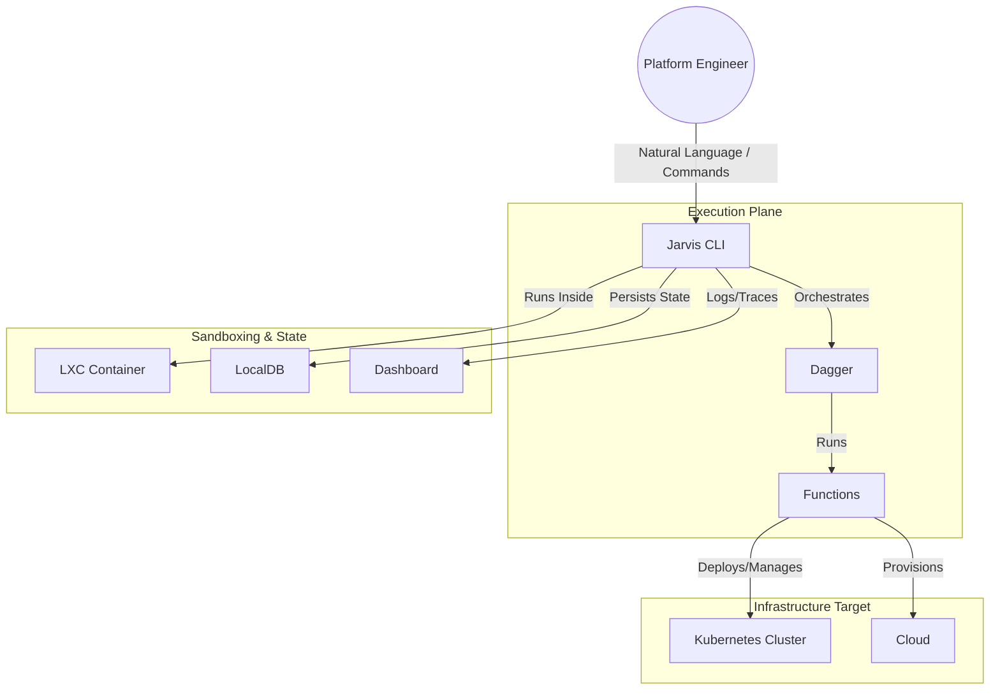
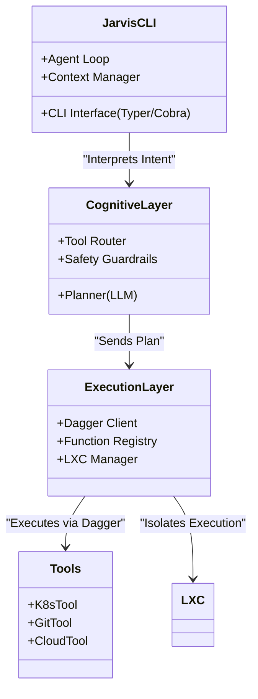
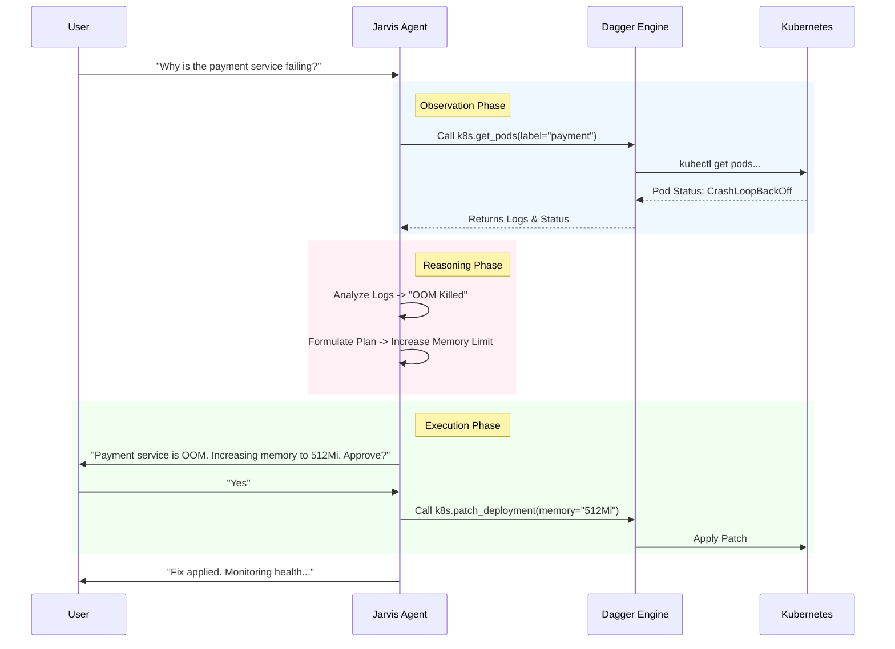

# Jarvis CLI: Agentic Architecture & SDLC Plan

Based on your "Jarvis CLI" concept and the current landscape of agentic automation, I have designed a software architecture that treats the CLI not just as a tool, but as a "Synthetic Operator." This architecture leverages Dagger for portable execution, LXC for robust sandboxing (as requested), and a modular design for K8s integration.

### 1. Software Architecture

This architecture follows the **"Agentic Controller"** pattern. The CLI acts as the brain (Control Plane), Dagger acts as the muscle (Execution Plane), and LXC provides the immune system (Isolation Plane).

#### **System Context Diagram (C4 Level 1)**

This high-level view shows how Jarvis CLI sits between the Platform Engineer and the underlying infrastructure.

#### **Container Architecture (C4 Level 2)**

This details the internals of the `Jarvis CLI`. It separates the "Cognitive Engine" (LLM processing) from the "Deterministic Executor" (Dagger).

#### **Execution Sequence: "Fix Broken Pod"**

A sequence diagram showing how Jarvis handles a "chicken and egg" infrastructure problem (e.g., checking a pod status before trying to port-forward).

---

### 2. SDLC Plan: Building Jarvis

This plan moves from a "Script Runner" to a fully "Agentic Platform."

#### **Phase 1: The "Determinist" (Foundation)**

* **Goal**: Build a solid Dagger-based CLI that runs deterministic functions in LXC.
* **Key Features**:
* CLI scaffolding (Go or Python).
* Integration of Dagger SDK.
* Basic "Tools" module: `kubectl` wrappers, `git` ops.
* LXC containerization of the tool itself for portability.

* **Deliverable**: A CLI that can run `jarvis run k8s:check-health` reliably.

#### **Phase 2: The "Observer" (Read-Only Agency)**

* **Goal**: Add the LLM "Brain" to read context and suggest plans.
* **Key Features**:
* Integrate LLM API (Gemini/Claude).
* Implement "Plan Mode" (Read-only analysis).
* Build the `Dashboard` (TUI or simple Web view) to visualize Dagger traces.

* **Deliverable**: You ask "What's wrong with prod?" and it generates a markdown report using real Dagger function outputs.

#### **Phase 3: The "Operator" (Active Agency)**

* **Goal**: Allow the agent to execute write operations with guardrails.
* **Key Features**:
* Implement "Human-in-the-loop" approval gates.
* Add "Remote Execution" to offload heavy Dagger runs to a cloud runner.
* "Self-Healing" workflows (if step A fails, try step B).

* **Deliverable**: `jarvis fix --auto` (with permissions) that can restart deployments or rollback git commits.

---

### 3. The "Mega-Prompt" for Gemini

Use this prompt to bootstrap the entire project structure. It is engineered to force Gemini to use best practices for Dagger and Agentic design.

**Copy and paste this into Gemini:**

> **Context:** I am building "Jarvis CLI," an agentic infrastructure automation tool for platform engineers. It is designed to replace fragile CI/CD pipelines with an intelligent CLI that runs locally but can execute remotely.
> **Core Tech Stack:**
> * **Language:** Go (Golang) for the CLI and Agent logic.
> * **Engine:** Dagger.io (Go SDK) for all execution steps (this is non-negotiable; all side effects must happen via Dagger).
> * **Isolation:** The tool itself must be packageable as a Docker container, but internally it should leverage LXC concepts or nested containers for tool isolation where applicable.
> * **LLM Integration:** Google Gemini API for the "Reasoning" layer.
> 
> 
> **Requirements:**
> 1. **Project Structure:** Generate a production-ready file structure for a Go CLI app. Include directories for `cmd` (CLI entry), `internal/agent` (LLM logic), `internal/dagger` (Dagger function bindings), and `pkg/k8s` (Kubernetes utilities).
> 2. **The "Brain" Interface:** Write a Go interface `Agent` that takes a user prompt and returns a `Plan`. A `Plan` should be a sequence of Dagger function calls.
> 3. **Dagger Integration:** Write a helper function that initializes the Dagger client and connects to a remote engine if a `REMOTE_DAGGER_ADDR` env var is set (Remote Execution feature).
> 4. **K8s Tooling:** Create a Dagger function wrapper in Go that spins up a lightweight container (like `bitnami/kubectl`), mounts the user's `~/.kube/config`, and executes a command safely.
> 5. **Dashboarding:** Sketch out a simple TUI (Text User Interface) using the `bubbletea` library that streams Dagger logs in real-time as the agent executes the plan.
> 
> 
> **Output:**
> Please write the `main.go` entry point, the `agent.go` logic, and the `dagger_client.go` setup. Use comments to explain how the "Plan -> Execute" loop works and how it ensures safety (e.g., asking for user confirmation before "Write" operations).